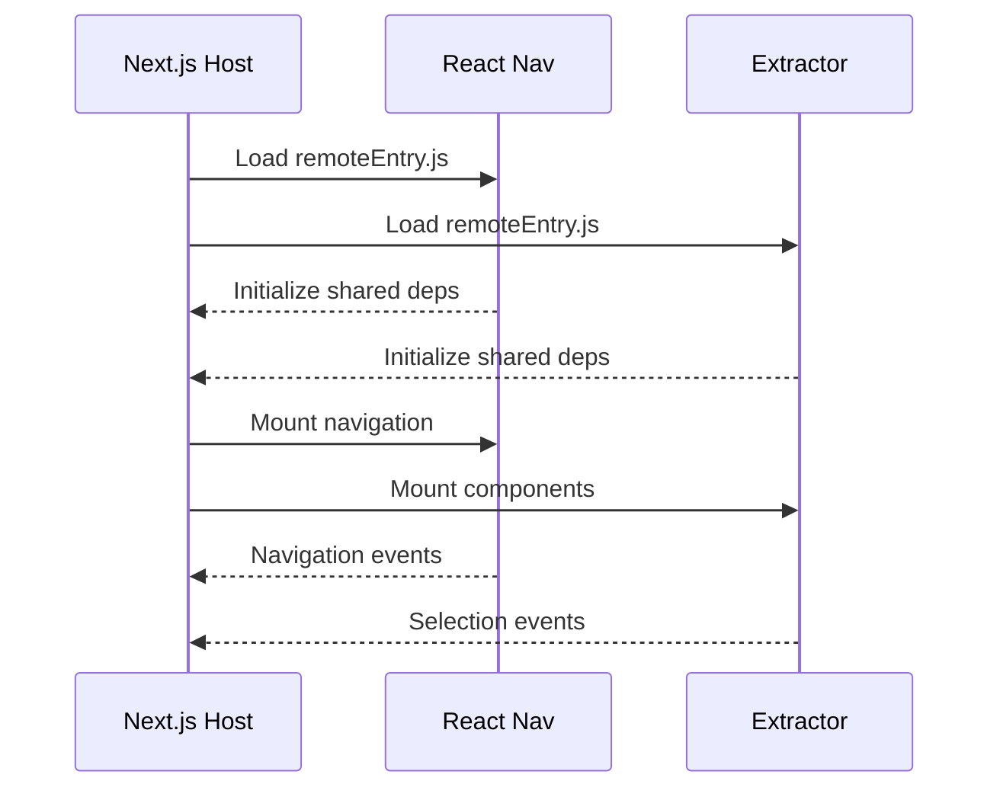

# Microfrontend Setup and Running Instructions

This document outlines how to run the microfrontend applications in different modes - both as independent UIs and as integrated remote modules with Next.js.

## Project Structure

```
Microfrontend/
├── next-app/        # Host application (Next.js)
├── react-nav/       # Navigation UI remote (React)
└── extracator/      # Extractor UI remote (React)
```

## Running the Applications

There are two modes of operation:

### 1. Development Mode (Independent UIs)

In this mode, each application runs independently with its own React instance. Use this when developing individual UIs.

```bash
# Start Navigation UI (runs on port 3002)
cd react-nav
npm start

# Start Extractor UI (runs on port 3001)
cd extractor
npm start

# Start Next.js app (runs on port 3000)
cd next-app
npm run dev
```

### 2. Integration Mode (With Next.js Host)

In this mode, the remote applications are configured to work with the Next.js host application, sharing React instances.

```bash
# Start Navigation UI in remote mode
cd react-nav
npm start:remote

# Start Extractor UI in remote mode
cd extractor
npm start:remote

# Start Next.js host app
cd next-app
npm run dev
```

## Important Notes

1. Port Configuration:
   - Next.js host: Port 3000
   - Navigation UI: Port 3002
   - Extractor UI: Port 3001

2. Running Order:
   - Always start the remote applications (react-nav and extractor) first
   - Then start the Next.js host application

3. Mode Selection:
   - Use `npm start` for independent development
   - Use `npm run start:remote` when integrating with Next.js

4. Development vs Remote Mode:
   - Development mode (`npm start`): Eager loading enabled, independent React instance
   - Remote mode (`npm run start:remote`): Eager loading disabled, shared React instance with host

5. Troubleshooting:
   - If you see module sharing errors in Next.js integration, ensure remotes are running in remote mode
   - If you see React instance conflicts, verify all apps are using the same React version (^18.2.0)
   - Clear browser cache if changes aren't reflecting

## Building for Production

```bash
# Build Navigation UI
cd react-nav
npm run build

# Build Extractor UI
cd extractor
npm run build

# Build Next.js app
cd next-app
npm run build
```

## Environment Configuration

Make sure the following environment variables are set in your Next.js application:

```env
NEXT_PUBLIC_MICROUI_NAVIGATION_REMOTE_URL=http://localhost:3002/remoteEntry.js
NEXT_PUBLIC_MICROUI_CONTENT_REMOTE_URL=http://localhost:3001/remoteEntry.js
```

## Version Requirements

- React: ^18.2.0
- React DOM: ^18.2.0
- Next.js: 14.0.3
- Node.js: >=16.0.0

## Additional Commands

### Clean Install
If you encounter any issues, try a clean installation:

```bash
# For each project directory:
npm cache clean --force
rm -rf node_modules
rm package-lock.json
npm install
```

### Development with Hot Reload
All start commands include hot reloading by default. Changes will be reflected immediately in the browser.

## Applications Overview

### 1. Next.js Host Application (Port 3000)
- **Role**: Main container application
- **Responsibilities**:
  - Loads and manages remote components
  - Handles routing and layout
  - Manages shared dependencies
  - Orchestrates communication between remotes

### 2. React Navigation Remote (Port 3002)
- **Role**: Navigation component provider
- **Responsibilities**:
  - Provides navigation UI
  - Handles routing state
  - Manages navigation events

### 3. Extractor Remote (Port 3001)
- **Role**: Category and geography selection provider
- **Responsibilities**:
  - Manages category selection
  - Handles geography selection
  - Provides search functionality

## Integration Flow

### 1. Initial Load
1. Host application starts (localhost:3000)
2. Remote entries are registered in webpack configuration
3. Shared dependencies are initialized
4. React singleton instance is established

### 2. Runtime Integration


## Technical Implementation

### 1. Shared Dependencies
```javascript
// Consistent across all applications
shared: {
  react: {
    singleton: true,
    requiredVersion: deps.react,
    eager: true,
    strictVersion: false
  },
  'react-dom': {
    singleton: true,
    requiredVersion: deps['react-dom'],
    eager: true,
    strictVersion: false
  }
}
```

### 2. Communication Pattern
- **Remote to Host**: Props and callbacks
- **Host to Remote**: Configuration props
- **Cross-Remote**: Through host application

## Loading Process

1. **Bootstrap**
   ```mermaid
   graph LR
       A[Load Host] --> B[Initialize Shared Deps]
       B --> C[Load Remote Entries]
       C --> D[Mount Remote Components]
   ```

2. **Component Loading**
   - Host requests remote component
   - Remote module is dynamically imported
   - Component is mounted with error boundary
   - State management is initialized

## Error Handling

### 1. Module Loading Errors
- Error boundaries catch runtime errors
- Fallback UI displayed
- Retry mechanism available

### 2. Version Mismatch
- Shared singleton prevents conflicts
- Version compatibility managed
- Strict version checking disabled

## Development Workflow

### 1. Local Development
```bash
# Terminal 1 - Start Host
cd next-app
npm run dev    # Port 3000

# Terminal 2 - Start Navigation
cd react-nav
npm start      # Port 3002

# Terminal 3 - Start Extractor
cd extracator
npm start      # Port 3001
```

### 2. Build Process
```bash
# Build all applications
cd next-app && npm run build
cd ../react-nav && npm run build
cd ../extracator && npm run build
```

## Configuration Management

### 1. Development URLs
```typescript
const remotes = {
  reactnav: 'reactnav@http://localhost:3002/remoteEntry.js',
  extracator: 'extracator@http://localhost:3001/remoteEntry.js'
};
```

### 2. Production URLs
- Configure based on deployment environment
- Use environment variables
- Support different domains

## Best Practices

1. **Dependency Management**
   - Keep versions aligned
   - Use singleton pattern
   - Share core dependencies

2. **Error Handling**
   - Implement error boundaries
   - Provide fallback UI
   - Handle network issues

3. **Performance**
   - Use eager loading for critical modules
   - Implement code splitting
   - Optimize bundle sizes

## Common Troubleshooting

1. **Version Conflicts**
   - Check shared dependency versions
   - Verify singleton configuration
   - Review strictVersion settings

2. **Loading Issues**
   - Verify remote URLs
   - Check CORS configuration
   - Review network requests

3. **Integration Problems**
   - Validate module federation setup
   - Check remote entry points
   - Review error boundaries

## Future Considerations

1. **Scaling**
   - Add more remote applications
   - Implement shared state management
   - Enhanced error recovery

2. **Monitoring**
   - Add performance tracking
   - Implement logging
   - Monitor remote health

3. **Enhancement**
   - Add SSR support
   - Implement caching
   - Add analytics
